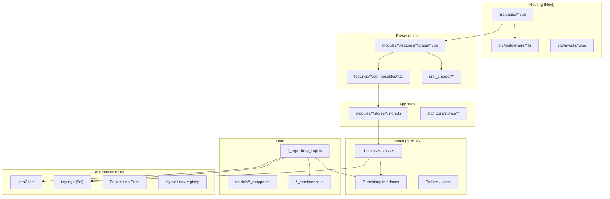

# Architecture

Modular **clean architecture** for Nuxt, aligned with [flutter_clean_starter](https://github.com/BrockMekonnen/flutter_clean_starter) and [go-clean-starter](https://github.com/BrockMekonnen/go-clean-starter).

Related docs: [state management](./state-management.md), [adaptive layout](./adaptive-layout.md), [icons](./icons.md), [large apps](./large-apps.md) (layers, SSR data, auth/i18n upgrades).

---

## Layer diagram



---

## Top-level folders

| Path                     | Purpose                                                                          |
| ------------------------ | -------------------------------------------------------------------------------- |
| `src/_core/`             | Cross-cutting infrastructure: DI, HTTP, errors, theme, adaptive layout, network  |
| `src/_shared/`           | Shared UI and feature screens used by multiple modules (home, settings, landing) |
| `src/modules/<feature>/` | Bounded context (business feature)                                               |
| `src/pages/`             | **File-based routes only** — thin wrappers; no business logic                    |
| `src/layouts/`           | Nuxt layouts (`default`, `app`, `landing`)                                       |
| `src/middleware/`        | Route guards (`auth`, `guest`)                                                   |
| `src/plugins/`           | Bootstrap: HTTP client, DI, theme, auth session                                  |
| `src/types/`             | TypeScript augmentations (`PageMeta`, `$di`, `$http`)                            |
| `i18n/locales/`          | Translation JSON files                                                           |

---

## Feature module layout

Mirror `src/modules/auth/`:

```
modules/<feature>/
  <feature>_tokens.ts      # tsyringe symbols
  <feature>_module.ts      # register<Feature>Module(di)
  <feature>_nav.ts         # optional: registerNavDestinations(...)
  domain/
    *_repository.ts        # interface
    *_usecases.ts          # business rules
    *.ts                   # entities / value types
  data/
    *_repository_impl.ts
    *_persistence.ts       # optional
    models/                # DTOs + mappers
  stores/
    <feature>.store.ts     # Pinia — calls use cases via $di
  features/
    <screen>/
      composables/         # optional UI facade (auto-imported)
      page/                # Vue SFCs for the screen
  __tests__/               # Vitest next to the code
```

---

## Dependency rules

Imports must use aliases for cross-root references: `@core`, `@shared`, `@modules` (enforced by ESLint).

| From → To   | Allowed                                                        |
| ----------- | -------------------------------------------------------------- |
| `domain/`   | Other `domain/` files, `@core/error` (failures only)           |
| `data/`     | `domain/`, `@core/http`, `@core/constants`                     |
| `stores/`   | `domain/`, `@core`, same module tokens                         |
| `features/` | `stores/`, composables, `@shared`, `@core` (icons/layout only) |
| `pages/`    | Feature `page/` components, nav constants, `definePageMeta`    |
| `_core/`    | Must not import `modules/` or `_shared/features`               |

**Do not:**

- Import `data/` from `domain/` or `features/`
- Call `$fetch` or `HttpClient` from Vue components or stores (use use cases → repository)
- Put validation/business rules only in the UI — duplicate light UI validation is fine; enforce in use cases

Nuxt **auto-imports** are limited to composables under `_core/**/composables`, `_shared/**/composables`, and `modules/**/features/**/composables`. Domain and data code use **explicit imports** so boundaries stay visible (`nuxt.config.ts` → `imports.dirs`).

---

## `pages/` vs `modules/*/features/*/page/`

Nuxt requires routes under `src/pages/`. Feature UI lives in modules so routing stays decoupled from implementation.

|                  | `src/pages/login.vue`                     | `modules/auth/features/login/page/login_page.vue` |
| ---------------- | ----------------------------------------- | ------------------------------------------------- |
| **Role**         | URL, layout, middleware, `definePageMeta` | Screen UI, forms, composables                     |
| **Imports**      | One feature page component                | `@shared`, `useAuth()`, etc.                      |
| **Changes when** | Route path, auth guard, nav tab, layout   | UX, fields, module logic                          |

Example thin page:

```vue
<!-- src/pages/profile.vue -->
<template>
  <ProfilePage />
</template>

<script setup lang="ts">
import ProfilePage from '@modules/auth/features/profile/page/profile_page.vue'
import { AUTH_NAV_TAB } from '@modules/auth/auth_nav'

definePageMeta({
  layout: 'app',
  middleware: 'auth',
  navTab: AUTH_NAV_TAB.profile,
  appTitle: 'profilePage.title',
  requiresAuth: true
})
</script>
```

---

## Dependency injection

1. `plugins/http.ts` provides `$http` (`HttpClient` via `$fetch`).
2. `plugins/10.di.ts` creates a **child** `tsyringe` container (SSR-safe), registers `$http`, runs `initBeforeAppRun(di)`.
3. Each module’s `register<Feature>Module(di)` binds repositories and use cases.
4. Pinia stores resolve use cases: `$di.resolve(AUTH_TOKENS.AuthUsecases)`.

Register new modules in `src/_core/_init_modules.ts`.

---

## State and errors

| Concern                   | Where                                                   |
| ------------------------- | ------------------------------------------------------- |
| Business logic            | `domain/*_usecases.ts`                                  |
| API / storage             | `data/*_repository_impl.ts`                             |
| Session / shared UI state | `stores/*.store.ts`                                     |
| Page-facing API           | `features/**/composables/use*.ts`                       |
| User-facing errors        | `@core/error/failures.ts`, `failureMessage()` in stores |

See [state-management.md](./state-management.md).

---

## Auth bootstrap (reference)

- Token: **cookie** (`Constants.authTokenCookie`) — SSR and client share it.
- User cache: **localStorage** on client only (fast reload; optional `getMe` skip).
- `plugins/auth.ts`: `callOnce('auth:bootstrap', () => useAuthStore().bootstrap())` hydrates session on server and dedupes on client.

---

## Route guards

| Meta                 | Middleware | Behavior                                                    |
| -------------------- | ---------- | ----------------------------------------------------------- |
| `requiresAuth: true` | `auth`     | Redirect to `/login?redirect=<path>` if no cookie / session |
| `guestOnly: true`    | `guest`    | Redirect authenticated users to first nav route             |

Typed in `src/types/page-meta.d.ts`. Middleware is **opt-in per page** (not global). See [auth-and-routing.md](./auth-and-routing.md).

---

## Adding a feature module

Reference modules:

- **`auth`** — API-backed login/session (cookie + optional localStorage user cache)
- **`todo`** — local-only CRUD with `localStorage` persistence (no backend required)

Use `auth` or `todo` as a template. Checklist:

1. **Scaffold** `src/modules/<feature>/` with `domain/`, `data/`, `stores/`, `features/`, `__tests__/`.
2. **Domain** — repository interface, entities, `<Feature>Usecases` with validation (`ValidationFailure`).
3. **Data** — `*RepositoryImpl`, DTOs/mappers, persistence if needed; map errors with `ApiError.from`.
4. **Tokens + module** — `<feature>_tokens.ts`, `register<Feature>Module(di)` in `<feature>_module.ts`.
5. **Wire DI** — call `register<Feature>Module(di)` from `src/_core/_init_modules.ts`.
6. **Store** — `defineStore`; actions call use cases via `$di`, not HTTP directly.
7. **Composable** (optional) — `features/<screen>/composables/use<Feature>.ts` wrapping the store.
8. **Feature pages** — Vue SFCs under `features/<screen>/page/`.
9. **Thin routes** — `src/pages/<route>.vue` importing feature pages + `definePageMeta`.
10. **Navigation** (if in app shell) — `<feature>_nav.ts`, register in `src/_core/layout/init_navigation.ts`.
11. **i18n** — keys in `i18n/locales/*.json`.
12. **Tests** — `__tests__/` for use cases and repository; store tests with `@vitest-environment nuxt` when needed.

---

## API configuration

`NUXT_PUBLIC_API_BASE` → `runtimeConfig.public.apiBase` (default `/api`, same-origin BFF). Server-only `NUXT_API_UPSTREAM` feeds `src/server/api/[...path].ts`. Env vars are validated with Zod at boot — see [api-proxy.md](./api-proxy.md). Paths live in `src/_core/constants.ts` (`ApiPaths`).

## Layer boundaries in CI

`npm run depcruise` enforces rules in `.dependency-cruiser.cjs` (e.g. `domain` must not import `data`).

---

## Quality commands

```bash
npm run typecheck
npm run lint
npm run test
npm run build
```

See [CONTRIBUTING.md](../CONTRIBUTING.md) for contributor workflow.
